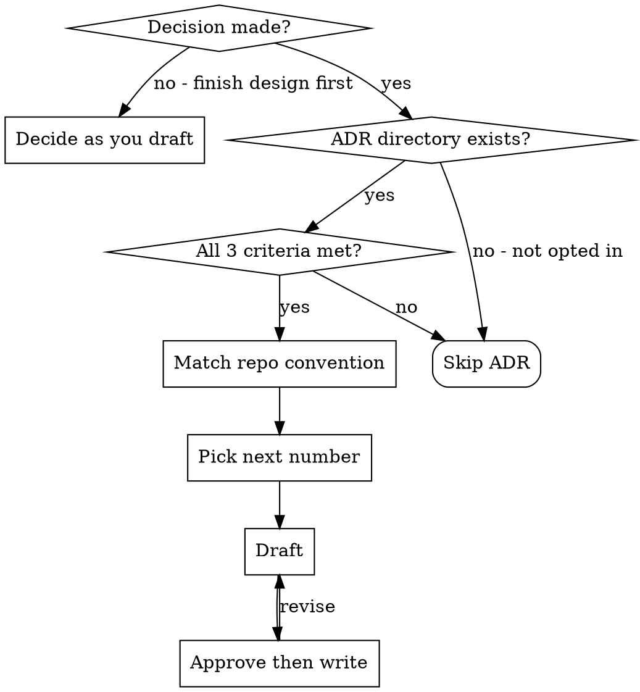

# Writing ADRs (Architecture Decision Records)

## Overview

ADRs capture the *why* behind significant architectural choices so future engineers and agents don't re-decide them. One ADR per decision, written once the decision is *finalised and approved* — not while it is still being explored. Drafting an ADR before the spec is agreed risks recording a decision the user later revises.

**Hard precondition:** Only use this skill when the project already has a dedicated ADR directory. If the project has no ADR convention, do NOT bootstrap one — the project has not opted in. Simply mention in the design doc that an ADR would be appropriate if the team adopts the convention.

## When to Use

All three must be true (these are the same three criteria used by the domain-modeling skill — same bar, no exceptions):

1. **Hard to reverse** — backout cost is meaningful (a quarter of work, not a rename)
2. **Surprising without context** — a future reader will look at the code and wonder "why on earth did they do it this way?"
3. **Result of a real trade-off** — genuine alternatives existed and we picked one for specific reasons

If any of the three is missing, skip the ADR.

### What qualifies

- **Architectural shape** — "We're using a monorepo." "The write model is event-sourced, the read model is projected into Postgres."
- **Integration patterns between subsystems** — "Ordering and Billing communicate via domain events, not synchronous HTTP."
- **Technology choices that carry lock-in** — database, message bus, auth provider, deployment target. Not every library — just the ones that would take a quarter to swap out.
- **Boundary/scope decisions** — "Customer data is owned by the Customer context; others reference it by ID only." Explicit no-s are as valuable as yes-s.
- **Deliberate deviations from the obvious path** — "We're using manual SQL instead of an ORM because X." Anything where a reasonable reader would assume the opposite — these stop the next engineer from "fixing" something that was deliberate.
- **Constraints not visible in the code** — "We can't use AWS because of compliance requirements." "Response times must be under 200ms because of the partner API contract."

### What does NOT qualify

- Library versions, formatting rules, naming conventions
- Decisions that are trivially reversible
- Things the code already explains unambiguously

## Workflow



### 1. Detect the ADR convention

Search likely locations: `docs/adr/`, `docs/architecture/adr/`, `adr/`, `docs/decisions/`. If multiple exist, prefer the one with the most recent activity.

If ADR files already exist, read 1–2 to infer:

- Directory and numbering pattern (`0001-`, `01-`, `1-`)
- Filename slug convention (kebab-case, dates, plain slugs)
- Title format (`# ADR-0001: ...` vs `# Plain title`)
- Section headings actually used — some repos use Status/Context/Decision/Consequences, some use a single paragraph

**Match the repo's existing convention exactly. Do not impose a template.** If the project has multiple ADR directories (per-context subdirectories), use the one most relevant to the decision.

### 2. Pick the next number

Scan existing files in the chosen directory, find the highest number, increment. Start at `0001` if the directory is empty.

### 3. Draft

If the repo has no settled template (i.e. the directory exists but is empty or the existing ADRs are inconsistent), use this minimal one:

```markdown
# ADR-NNNN: <Decision Title>

## Status

Proposed

## Context

What problem, constraints, or trade-offs drove this decision.

## Decision

What architectural choice was made.

## Consequences

What becomes easier, harder, riskier, or more expensive. Include both positive and negative.
```

An ADR can be shorter than this — a single paragraph is fine when the decision is simple. The value is recording *that* a decision was made and *why*, not filling out sections. Add an **Alternatives Considered** section only when the rejected paths are worth remembering (e.g. someone will likely re-suggest them in six months).

Drafting rules:

- Title specific and decision-oriented ("Adopt PostgreSQL", "Settle ownership boundary between Ordering and Billing")
- Capture enough context that someone arriving cold understands why the decision was needed
- State the decision directly, not as a recommendation
- Be honest about downsides — both positive and negative consequences
- Do not invent rationale, constraints, or outcomes. If information is missing, ask before finalising
- Insert placeholders (`<!-- TODO: ... -->`) for any genuinely missing piece the user must confirm, rather than fabricating

### 4. Approve then write

Before writing files, present:

- proposed file path (directory + filename)
- proposed title
- ADR status
- a concise preview of the drafted sections

After approval:

1. Write the ADR file to the discovered ADR directory
2. Report the final path and a one-sentence summary
3. Stop — this skill drafts **new** ADRs only

## When NOT to use this skill

- The project has no ADR directory (don't bootstrap one unilaterally)
- The decision is not architectural (use an inline comment in the code instead)
- The decision is still being *explored* — finish the design conversation first; ADRs record decided things
- You're editing, superseding, or renumbering an existing ADR — this skill drafts **new** ADRs only. Supersession is a separate manual step the user can ask for explicitly.

## Common Mistakes

| Mistake | Fix |
|---|---|
| Bootstrapping `docs/adr/` when the project has no ADR convention | Skip ADR — the project hasn't opted in. Mention in the design doc instead. |
| Imposing the Status/Context/Decision/Consequences template on a single-paragraph repo | Match the existing convention, even if it's terse. |
| Writing the ADR before the decision is actually made | Wait until the design is approved. ADRs record decisions, not explore them. |
| Documenting every library pick | Only lock-in-grade decisions. |
| Fabricating trade-offs to "fill out" the template | Skip optional sections if empty. Ask the user instead of guessing. |
| Updating or superseding an existing ADR | Stop — this skill is new ADRs only. Tell the user to do supersession manually. |

## Red Flags — STOP and Skip the ADR

- "The project doesn't have an ADR directory but I'll make one anyway" → don't
- "It's only a small choice" → not ADR-worthy
- "I'll fill in the context later" → draft when context is fresh; if you can't, ask
- "The user asked for an ADR but the decision isn't made yet" → finish the design discussion first, then offer the ADR

## Verification

Before claiming the ADR is written:

- [ ] File exists at the path you reported (read it back)
- [ ] Filename matches the repo's numbering + slug convention
- [ ] Title, sections, and tone match any existing ADRs in the same directory
- [ ] No fabricated context, consequences, or alternatives
- [ ] No leftover `<!-- TODO -->` placeholders the user did not approve leaving